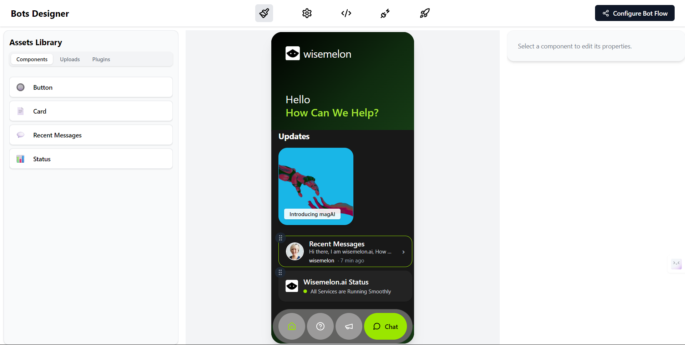
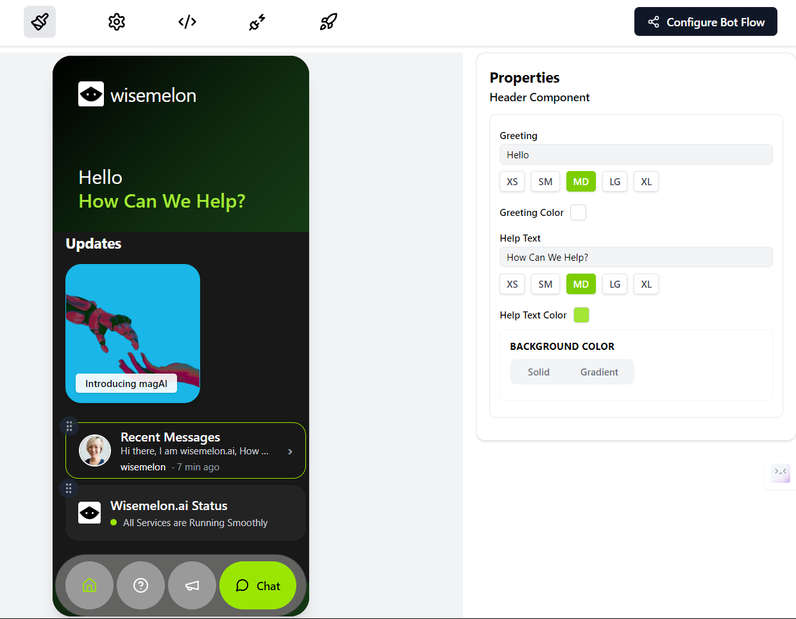
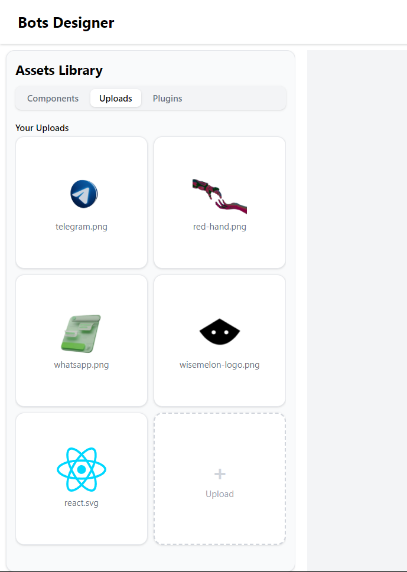

# Wisemelon Bot Designer

A modular, Figma-style Bot Designer UI built with React, Zustand, and Tailwind CSS. Design and customize conversational UIs with a live phone mockup, drag-and-drop, and a modern properties panel.

> **Note:** This is a sample project to showcase frontend development skills and match a pixel-perfect UI of a phone component, based on a provided design reference. Some extra functionalities and interactivity have also been added for demonstration purposes.





## Usage & Interactivity

- **To edit or see properties:** Click on any element (header, updates/cards, recent messages, status) in the phone preview. The right sidebar will update with dynamic properties for the selected component.
- **Recent and Status components:** These are vertically draggable. You can reorder them by dragging the handle on the left.
- **Button elements:** When added, they appear horizontally in the Updates section. If there are many, you can scroll horizontally to see all buttons and cards.
- **Remove elements:** Most elements (except the header) can be removed via the properties panel.
- **Bottom navigation:** The bottom nav bar is horizontally draggable and reorderable.

---

## Features

- **Figma-inspired UI:** Modern, pixel-perfect, and highly interactive.
- **Left Sidebar:**
  - Components, Uploads (image library), and Plugins tabs
  - Drag components onto the canvas
  - Upload and use custom images
- **Central Canvas:**
  - Phone mockup with header, cards, buttons, recent messages, and status
  - Live preview of all changes
  - Drag-and-drop to reorder cards, buttons, and layout components
- **Right Sidebar (Properties Panel):**
  - Dynamic, config-driven property editing for any selected component
  - Universal background picker (solid/gradient)
  - Figma-style color pickers, layout controls, and more
- **State Management:** Powered by Zustand for fast, global state updates
- **Styling:** Tailwind CSS for rapid, consistent, and modern design

## Tech Stack

- **React** (functional components, hooks)
- **Zustand** (state management)
- **Tailwind CSS** (utility-first styling)
- **dnd-kit** (drag-and-drop)
- **Lucide React** (icons)

## Getting Started

### Prerequisites

- Node.js (v16 or higher recommended)
- npm or yarn

### Installation

1. **Clone the repository:**
   ```bash
   git clone <your-repo-url>
   cd bot-designer
   ```
2. **Install dependencies:**
   ```bash
   npm install
   # or
   yarn install
   ```

### Running Locally

```bash
npm run dev
# or
yarn dev
```

- The app will be available at `http://localhost:3000` by default.

## How It Works

- **Add components** from the left sidebar to the phone canvas.
- **Select any component** to edit its properties in the right sidebar.
- **Drag and drop** to reorder cards, buttons, and layout elements.
- **Upload images** and use them in your card components.
- **All changes are live** and reflected instantly in the phone preview.

## Folder Structure

- `src/components/` — All UI components (Canvas, RightSidebar, LeftSidebar, etc.)
- `src/store/` — Zustand store for global state
- `src/constants/` — Property configs, component lists, etc.
- `src/assets/` — Images and static assets

## Customization

- Easily add new component types by updating `propertyConfigs.js` and `componentsList.js`.
- All property panels are config-driven for easy extensibility.

## License

MIT
